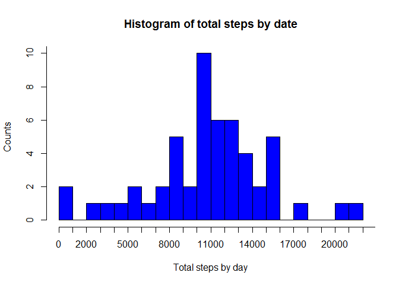
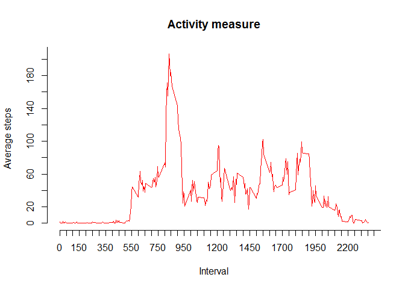
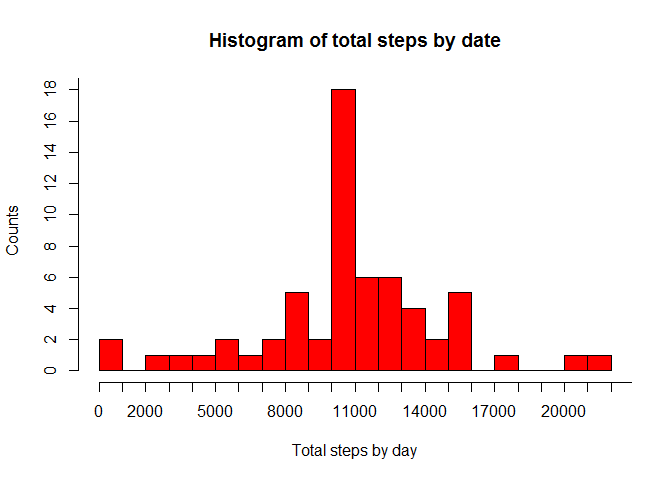
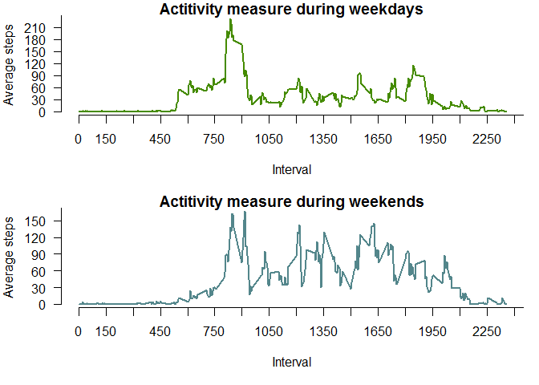

# RPA1
Tonda  
2015-07-20  


```r
require(knitr)
```

```
## Loading required package: knitr
```

```r
opts_chunk$set(echo = TRUE, cache = TRUE, cache.path = "cache/", fig.path = "figure/")
```

This is markdown file for Peer Assessment 1 in Reproducible research course 
===========================================================================


## Loading and preprocessing the data

Read the activity.csv data into R object. We assume you download and unzip the data already and set working directory as well. 


```r
dataset <- read.csv("activity.csv")
```

Check the data.


```r
str(dataset)
```

```
## 'data.frame':	17568 obs. of  3 variables:
##  $ steps   : int  NA NA NA NA NA NA NA NA NA NA ...
##  $ date    : Factor w/ 61 levels "2012-10-01","2012-10-02",..: 1 1 1 1 1 1 1 1 1 1 ...
##  $ interval: int  0 5 10 15 20 25 30 35 40 45 ...
```

```r
sum(is.na(dataset[,1]))
```

```
## [1] 2304
```

## What is mean and median total number of steps taken per day?

##### Make a histogram of the total number of steps taken each day #####

Calculate total steps per day.
We store the result into total_steps-NA data frame. 


```r
library(reshape2); library(dplyr)
```


```r
total_steps_NA <- aggregate( steps ~ date, data=dataset, FUN=sum)
```

Create histogram of the total number of steps taken per day


```r
rg_NA <- range(total_steps_NA$steps)
with(total_steps_NA, hist(steps, main="Histogram of total steps by date",
                            xlab = "Total steps by day",ylab = "Counts", col = "blue",
                            breaks=20, axes=FALSE))
axis(1, at=1000*0:rg_NA[2])
axis(2, at=2*0:20)
```

 

Calculate the mean and the median of total number of steps per day

**In this case we consider that in the measured values of steps are a lots of 'NA' and '0' or 'Zeros'. According to this fact we calculate the mean and median of total steps without NAs and Zeros both with and without NA's correction.** 

Check total number of NAs and Zeros 


```r
sum(is.na(dataset$steps))
```

```
## [1] 2304
```

```r
sum(dataset$steps==0, na.rm=T)
```

```
## [1] 11014
```

Mean and median of total number of steps without NA's correction. 

```r
M_steps_na <-     mean(dataset$steps[dataset$steps!=0], na.rm=T)
Md_steps_na <-    median(dataset$steps[dataset$steps!=0], na.rm=T)
```

The mean of total number of steps without NA's correction is **134.2607059** and median is **56.** 

## What is the average daily activity pattern?

Calculate avarage steps of intervals accross all days.
Remove the days without activity. 
We store the result into steps_interval data frame. 


```r
steps_interval_mean <- aggregate( steps ~ interval, data=dataset, FUN=mean)
```

Make a plot of the average steps within interval 


```r
rg_I  <- range(steps_interval_mean$interval)
rg_I2 <- range(steps_interval_mean$steps)

with(steps_interval_mean, plot(interval, steps, type="n", lwd = 2, axes=FALSE, xlab="Interval", ylab="Average steps"))

axis(1, at=50*0:rg_I[2]) 
axis(2, at=20*0:rg_I2[2])
with(steps_interval_mean, lines(interval, steps, col="red"))
title(main='Activity measure')
```

 

*Which 5-minute interval, on average across all the days in the dataset, contains the maximum number of steps?* 


```r
steps_interval_max <-  aggregate(steps ~ interval, data=dataset, FUN=sum)

steps_interval_max <- steps_interval_max[order(steps_interval_max[2], decreasing=T),]

max_i <- steps_interval_max[1,]; names(max_i) <- c('ID of interval', 'Number of steps'); print(max_i)
```

```
##     ID of interval Number of steps
## 104            835           10927
```

The 5-minute interval which contains the maximum number of steps is interval number  **835.**


Calculate the total number of missing values in the dataset 


```r
sum_na <- sum(is.na(dataset))
```
**Total number of missing values in the dataset 'activity' is 2304.** 

Find NA value in dataset and replace them by average number of steps within the interval accross all days.


```r
interval <- unique(dataset$interval)
for (i in interval) {
      dataset[dataset$interval==i & is.na(dataset$steps), "steps"] <- 
      steps_interval_mean[steps_interval_mean$interval==i, "steps"]      
}

sum(is.na(dataset)) ## check 
```

```
## [1] 0
```

Calculate the total sum of steps each day


```r
total_steps <- aggregate(steps ~ date, data=dataset, FUN=sum)
```

Create histogram of the total number of steps taken per day.


```r
rg <- range(total_steps$steps)
with(total_steps, hist(steps, main="Histogram of total steps by date",
                            xlab = "Total steps by day",ylab = "Counts", col = "red",
                            breaks=20, axes=F))
axis(1, at=1000*0:rg[2])
axis(2, at=2*0:20)
```

 

Calculate mean and median of steps taken per day


```r
M_steps  <-     mean(dataset$steps[dataset$steps!=0])
Md_steps <-    median(dataset$steps[dataset$steps!=0])
```

The *mean* of total number of steps *without NA's correction* is **134.2607059**, in contrast the  *mean* of total number of steps **WITH NA's correction** is **102.5831786**. On the other hand the *median without NA's correction* is **56**, in contrast the *median WITH NA's correction* is **45.3396226**.

We can see the discrepancy between the values calculated from 'with' or 'without' NA's correction. It may seem weird that values from without NA's correction are bigger. But we have to consider bigger total sum of particular elements for dataset with NA's correction which could affect the values of mean and median significantly. 

## Are there differences in activity patterns between weekdays and weekends?

We use weekdays() fuction and filter() function from dplyr package to subset and compare activity from weekdays and weekends. 

**Please note that names of weekdays are in Slovak language**
Legend:

1. pondelok    = *"Monday"*
2. utorok      = *"Tuesday"*
3. streda      = *"Wednesday"*
4. štvrtok     = *"Thursday"*
5. piatok      = *"Friday"*
6. sobota      = *"Saturday"*
7. nedeľa      = *"Sunnday"*


```r
dataset$date <- as.Date(as.character(dataset$date)) ## set date variable to Date class

## subset weekdays activity 
df_weekdays <- filter(dataset, weekdays(date)=='pondelok'| weekdays(date)=='utorok' | weekdays(date)=='streda'| weekdays(date)=='štvrtok'| weekdays(date)=='piatok')

## subset weekend activity 
df_weekend <- filter(dataset, weekdays(date)=='sobota'| weekdays(date)=='nedeľa')

weekdays_avg <- aggregate(steps ~ interval, data=df_weekdays, FUN=mean)
 
weekends_avg <- aggregate(steps ~ interval, data=df_weekend, FUN=mean)
```


```r
par(mfrow = c(2,1), mar=c(5,4,1,1), las=1)

## Plot for Weekdays 
rg_d1  <- range(weekdays_avg$interval)
rg_d2 <- range(weekdays_avg$steps)

with(weekdays_avg, plot(interval, steps, type="n", axes=F, xlab="Interval", ylab="Average steps"))
axis(1, at=150*0:rg_d1[2]) 
axis(2, at=30*0:rg_d2[2])
with(weekdays_avg, lines(interval, steps, col="chartreuse4", lwd = 2))
title(main='Actitivity measure during weekdays')

## Plot for Weekends
rg_e1  <- range(weekends_avg$interval)
rg_e2  <- range(weekends_avg$steps)

with(weekends_avg, plot(interval, steps, type="n", axes=F, xlab="Interval", ylab="Average steps"))
axis(1, at=150*0:rg_d1[2]) 
axis(2, at=30*0:rg_d2[2])
with(weekends_avg, lines(interval, steps, col="cadetblue4", lwd = 2))
title(main='Actitivity measure during weekends')
```

 
