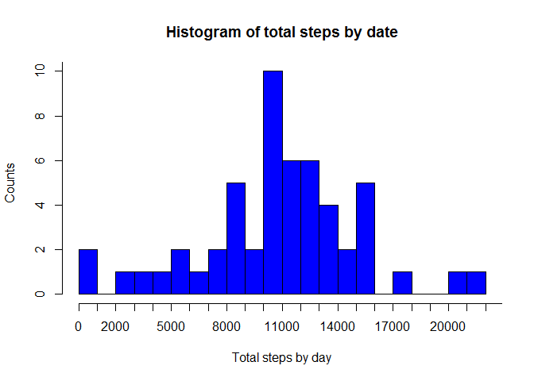
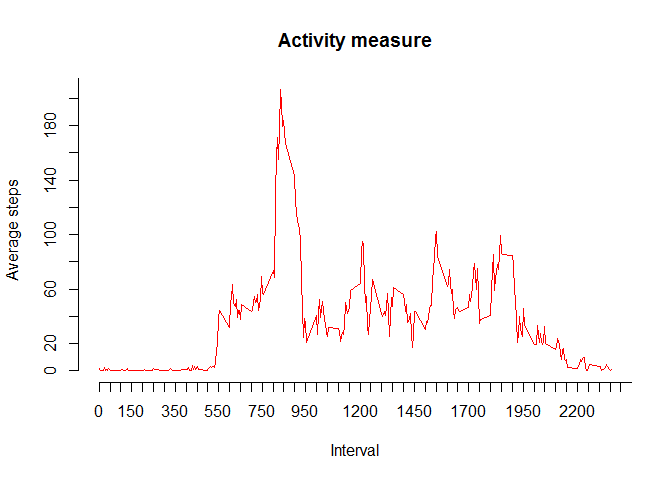
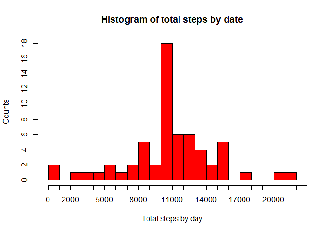
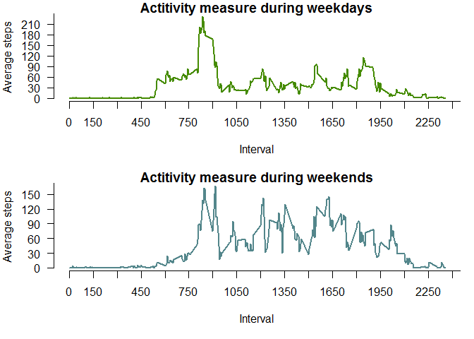

# RPA1
Tonda  
2015-07-20  

This is markdown file for Peer Assessment 1 in Reproducible research course 
===========================================================================


## Loading and preprocessing the data

Read the activity.csv data into R object. We assume you download and unzip the data already and set working directory as well. 


```r
dataset <- read.csv("activity.csv")
```

Check the data.


```r
str(dataset)
```

```
## 'data.frame':	17568 obs. of  3 variables:
##  $ steps   : int  NA NA NA NA NA NA NA NA NA NA ...
##  $ date    : Factor w/ 61 levels "2012-10-01","2012-10-02",..: 1 1 1 1 1 1 1 1 1 1 ...
##  $ interval: int  0 5 10 15 20 25 30 35 40 45 ...
```

```r
sum(is.na(dataset[,1]))
```

```
## [1] 2304
```

## What is mean and median total number of steps taken per day?

##### Make a histogram of the total number of steps taken each day #####

Calculate total steps per day.
We use reshape2 and plyr packages for this.
We store the result into total_steps data frame. 


```r
library(reshape2); library(dplyr)
```

```
## 
## Attaching package: 'dplyr'
## 
## The following object is masked from 'package:stats':
## 
##     filter
## 
## The following objects are masked from 'package:base':
## 
##     intersect, setdiff, setequal, union
```


```r
total_steps_NA <- aggregate( steps ~ date, data=dataset, FUN=sum)
```

Create histogram of the total number of steps taken per day


```r
rg_NA <- range(total_steps_NA$steps)
with(total_steps_NA, hist(steps, main="Histogram of total steps by date",
                            xlab = "Total steps by day",ylab = "Counts", col = "blue",
                            breaks=20, axes=FALSE))
axis(1, at=1000*0:rg_NA[2])
axis(2, at=2*0:20)
```

 

Calculate the mean and the median of total number of steps per day


```r
M_steps_na <- aggregate( steps ~ date, data=dataset, FUN=mean)
Md_steps_na <- aggregate( steps ~ date, data=dataset, FUN=median)

steps_NA <- cbind(M_steps_na, Md_steps_na$steps)
names(steps_NA) <- c('Date', 'Mean of total steps/day', 'Median of total steps/day')
steps_NA
```

```
##          Date Mean of total steps/day Median of total steps/day
## 1  2012-10-02               0.4375000                         0
## 2  2012-10-03              39.4166667                         0
## 3  2012-10-04              42.0694444                         0
## 4  2012-10-05              46.1597222                         0
## 5  2012-10-06              53.5416667                         0
## 6  2012-10-07              38.2465278                         0
## 7  2012-10-09              44.4826389                         0
## 8  2012-10-10              34.3750000                         0
## 9  2012-10-11              35.7777778                         0
## 10 2012-10-12              60.3541667                         0
## 11 2012-10-13              43.1458333                         0
## 12 2012-10-14              52.4236111                         0
## 13 2012-10-15              35.2048611                         0
## 14 2012-10-16              52.3750000                         0
## 15 2012-10-17              46.7083333                         0
## 16 2012-10-18              34.9166667                         0
## 17 2012-10-19              41.0729167                         0
## 18 2012-10-20              36.0937500                         0
## 19 2012-10-21              30.6284722                         0
## 20 2012-10-22              46.7361111                         0
## 21 2012-10-23              30.9652778                         0
## 22 2012-10-24              29.0104167                         0
## 23 2012-10-25               8.6527778                         0
## 24 2012-10-26              23.5347222                         0
## 25 2012-10-27              35.1354167                         0
## 26 2012-10-28              39.7847222                         0
## 27 2012-10-29              17.4236111                         0
## 28 2012-10-30              34.0937500                         0
## 29 2012-10-31              53.5208333                         0
## 30 2012-11-02              36.8055556                         0
## 31 2012-11-03              36.7048611                         0
## 32 2012-11-05              36.2465278                         0
## 33 2012-11-06              28.9375000                         0
## 34 2012-11-07              44.7326389                         0
## 35 2012-11-08              11.1770833                         0
## 36 2012-11-11              43.7777778                         0
## 37 2012-11-12              37.3784722                         0
## 38 2012-11-13              25.4722222                         0
## 39 2012-11-15               0.1423611                         0
## 40 2012-11-16              18.8923611                         0
## 41 2012-11-17              49.7881944                         0
## 42 2012-11-18              52.4652778                         0
## 43 2012-11-19              30.6979167                         0
## 44 2012-11-20              15.5277778                         0
## 45 2012-11-21              44.3993056                         0
## 46 2012-11-22              70.9270833                         0
## 47 2012-11-23              73.5902778                         0
## 48 2012-11-24              50.2708333                         0
## 49 2012-11-25              41.0902778                         0
## 50 2012-11-26              38.7569444                         0
## 51 2012-11-27              47.3819444                         0
## 52 2012-11-28              35.3576389                         0
## 53 2012-11-29              24.4687500                         0
```

As you can see the values of medians are confusing. I tried many ways to calculate medians for each date according to the asingment but I didn't fixed it. 

## What is the average daily activity pattern?

Calculate avarage steps of intervals accross all days.
Remove the days without activity. 
We use reshape2 and plyr packages for this.
We store the result into steps_interval data frame. 


```r
steps_interval_mean <- aggregate( steps ~ interval, data=dataset, FUN=mean)
```

Make a plot of the average steps within interval 


```r
rg_I  <- range(steps_interval_mean$interval)
rg_I2 <- range(steps_interval_mean$steps)

with(steps_interval_mean, plot(interval, steps, type="n", lwd = 2, axes=FALSE, xlab="Interval", ylab="Average steps"))

axis(1, at=50*0:rg_I[2]) 
axis(2, at=20*0:rg_I2[2])
with(steps_interval_mean, lines(interval, steps, col="red"))
title(main='Activity measure')
```

 

*Which 5-minute interval, on average across all the days in the dataset, contains the maximum number of steps?* 


```r
steps_interval_max <-  aggregate(steps ~ interval, data=dataset, FUN=sum)

steps_interval_max <- steps_interval_max[order(steps_interval_max[2], decreasing=T),]

max_i <- steps_interval_max[1,]; names(max_i) <- c('ID of interval', 'Number of steps'); print(max_i)
```

```
##     ID of interval Number of steps
## 104            835           10927
```

The 5-minute interval which contains the maximum number of steps is interval number  835. 

Calculate the total number of missing values in the dataset 


```r
sum(is.na(dataset))
```

```
## [1] 2304
```

Find NA value in dataset and replace them by average number of steps within the interval accross all days.


```r
interval <- unique(dataset$interval)
for (i in interval) {
      dataset[dataset$interval==i & is.na(dataset$steps), "steps"] <- 
      steps_interval_mean[steps_interval_mean$interval==i, "steps"]      
}

sum(is.na(dataset)) ## check 
```

```
## [1] 0
```

Calculate the total sum of steps each day


```r
total_steps <- aggregate(steps ~ date, data=dataset, FUN=sum)
```

Create histogram of the total number of steps taken per day.


```r
rg <- range(total_steps$steps)
with(total_steps, hist(steps, main="Histogram of total steps by date",
                            xlab = "Total steps by day",ylab = "Counts", col = "red",
                            breaks=20, axes=F))
axis(1, at=1000*0:rg[2])
axis(2, at=2*0:20)
```

 

Calculate mean and median of steps taken per day


```r
M_steps <- aggregate(steps ~ date, data=dataset, FUN=mean)

Md_steps <- aggregate(steps ~ date, data=dataset, FUN=median)

MMd_steps <- cbind(M_steps, Md_steps$steps)

names(MMd_steps) <- c('Date', 'Mean of total steps/day', 'Median of total steps/day')
MMd_steps
```

```
##          Date Mean of total steps/day Median of total steps/day
## 1  2012-10-01              37.3825996                  34.11321
## 2  2012-10-02               0.4375000                   0.00000
## 3  2012-10-03              39.4166667                   0.00000
## 4  2012-10-04              42.0694444                   0.00000
## 5  2012-10-05              46.1597222                   0.00000
## 6  2012-10-06              53.5416667                   0.00000
## 7  2012-10-07              38.2465278                   0.00000
## 8  2012-10-08              37.3825996                  34.11321
## 9  2012-10-09              44.4826389                   0.00000
## 10 2012-10-10              34.3750000                   0.00000
## 11 2012-10-11              35.7777778                   0.00000
## 12 2012-10-12              60.3541667                   0.00000
## 13 2012-10-13              43.1458333                   0.00000
## 14 2012-10-14              52.4236111                   0.00000
## 15 2012-10-15              35.2048611                   0.00000
## 16 2012-10-16              52.3750000                   0.00000
## 17 2012-10-17              46.7083333                   0.00000
## 18 2012-10-18              34.9166667                   0.00000
## 19 2012-10-19              41.0729167                   0.00000
## 20 2012-10-20              36.0937500                   0.00000
## 21 2012-10-21              30.6284722                   0.00000
## 22 2012-10-22              46.7361111                   0.00000
## 23 2012-10-23              30.9652778                   0.00000
## 24 2012-10-24              29.0104167                   0.00000
## 25 2012-10-25               8.6527778                   0.00000
## 26 2012-10-26              23.5347222                   0.00000
## 27 2012-10-27              35.1354167                   0.00000
## 28 2012-10-28              39.7847222                   0.00000
## 29 2012-10-29              17.4236111                   0.00000
## 30 2012-10-30              34.0937500                   0.00000
## 31 2012-10-31              53.5208333                   0.00000
## 32 2012-11-01              37.3825996                  34.11321
## 33 2012-11-02              36.8055556                   0.00000
## 34 2012-11-03              36.7048611                   0.00000
## 35 2012-11-04              37.3825996                  34.11321
## 36 2012-11-05              36.2465278                   0.00000
## 37 2012-11-06              28.9375000                   0.00000
## 38 2012-11-07              44.7326389                   0.00000
## 39 2012-11-08              11.1770833                   0.00000
## 40 2012-11-09              37.3825996                  34.11321
## 41 2012-11-10              37.3825996                  34.11321
## 42 2012-11-11              43.7777778                   0.00000
## 43 2012-11-12              37.3784722                   0.00000
## 44 2012-11-13              25.4722222                   0.00000
## 45 2012-11-14              37.3825996                  34.11321
## 46 2012-11-15               0.1423611                   0.00000
## 47 2012-11-16              18.8923611                   0.00000
## 48 2012-11-17              49.7881944                   0.00000
## 49 2012-11-18              52.4652778                   0.00000
## 50 2012-11-19              30.6979167                   0.00000
## 51 2012-11-20              15.5277778                   0.00000
## 52 2012-11-21              44.3993056                   0.00000
## 53 2012-11-22              70.9270833                   0.00000
## 54 2012-11-23              73.5902778                   0.00000
## 55 2012-11-24              50.2708333                   0.00000
## 56 2012-11-25              41.0902778                   0.00000
## 57 2012-11-26              38.7569444                   0.00000
## 58 2012-11-27              47.3819444                   0.00000
## 59 2012-11-28              35.3576389                   0.00000
## 60 2012-11-29              24.4687500                   0.00000
## 61 2012-11-30              37.3825996                  34.11321
```

Now we can compare the results between the first and third part of assingment. 


```r
## compare means ## compare means ## compare means 

compare_mean <- merge(M_steps_na, M_steps, by="date", all.y=T)
names(compare_mean) <- c('Date', 'Without NA correction', 'With NA correction')
compare_mean
```

```
##          Date Without NA correction With NA correction
## 1  2012-10-01                    NA         37.3825996
## 2  2012-10-02             0.4375000          0.4375000
## 3  2012-10-03            39.4166667         39.4166667
## 4  2012-10-04            42.0694444         42.0694444
## 5  2012-10-05            46.1597222         46.1597222
## 6  2012-10-06            53.5416667         53.5416667
## 7  2012-10-07            38.2465278         38.2465278
## 8  2012-10-08                    NA         37.3825996
## 9  2012-10-09            44.4826389         44.4826389
## 10 2012-10-10            34.3750000         34.3750000
## 11 2012-10-11            35.7777778         35.7777778
## 12 2012-10-12            60.3541667         60.3541667
## 13 2012-10-13            43.1458333         43.1458333
## 14 2012-10-14            52.4236111         52.4236111
## 15 2012-10-15            35.2048611         35.2048611
## 16 2012-10-16            52.3750000         52.3750000
## 17 2012-10-17            46.7083333         46.7083333
## 18 2012-10-18            34.9166667         34.9166667
## 19 2012-10-19            41.0729167         41.0729167
## 20 2012-10-20            36.0937500         36.0937500
## 21 2012-10-21            30.6284722         30.6284722
## 22 2012-10-22            46.7361111         46.7361111
## 23 2012-10-23            30.9652778         30.9652778
## 24 2012-10-24            29.0104167         29.0104167
## 25 2012-10-25             8.6527778          8.6527778
## 26 2012-10-26            23.5347222         23.5347222
## 27 2012-10-27            35.1354167         35.1354167
## 28 2012-10-28            39.7847222         39.7847222
## 29 2012-10-29            17.4236111         17.4236111
## 30 2012-10-30            34.0937500         34.0937500
## 31 2012-10-31            53.5208333         53.5208333
## 32 2012-11-01                    NA         37.3825996
## 33 2012-11-02            36.8055556         36.8055556
## 34 2012-11-03            36.7048611         36.7048611
## 35 2012-11-04                    NA         37.3825996
## 36 2012-11-05            36.2465278         36.2465278
## 37 2012-11-06            28.9375000         28.9375000
## 38 2012-11-07            44.7326389         44.7326389
## 39 2012-11-08            11.1770833         11.1770833
## 40 2012-11-09                    NA         37.3825996
## 41 2012-11-10                    NA         37.3825996
## 42 2012-11-11            43.7777778         43.7777778
## 43 2012-11-12            37.3784722         37.3784722
## 44 2012-11-13            25.4722222         25.4722222
## 45 2012-11-14                    NA         37.3825996
## 46 2012-11-15             0.1423611          0.1423611
## 47 2012-11-16            18.8923611         18.8923611
## 48 2012-11-17            49.7881944         49.7881944
## 49 2012-11-18            52.4652778         52.4652778
## 50 2012-11-19            30.6979167         30.6979167
## 51 2012-11-20            15.5277778         15.5277778
## 52 2012-11-21            44.3993056         44.3993056
## 53 2012-11-22            70.9270833         70.9270833
## 54 2012-11-23            73.5902778         73.5902778
## 55 2012-11-24            50.2708333         50.2708333
## 56 2012-11-25            41.0902778         41.0902778
## 57 2012-11-26            38.7569444         38.7569444
## 58 2012-11-27            47.3819444         47.3819444
## 59 2012-11-28            35.3576389         35.3576389
## 60 2012-11-29            24.4687500         24.4687500
## 61 2012-11-30                    NA         37.3825996
```

```r
## compare medians ## compare medians ## compare medians 

compare_median <- merge(Md_steps_na, Md_steps, by="date", all.y=T)
names(compare_median) <- c('Without NA correction', 'With NA correction')
compare_median
```

```
##    Without NA correction With NA correction       NA
## 1             2012-10-01                 NA 34.11321
## 2             2012-10-02                  0  0.00000
## 3             2012-10-03                  0  0.00000
## 4             2012-10-04                  0  0.00000
## 5             2012-10-05                  0  0.00000
## 6             2012-10-06                  0  0.00000
## 7             2012-10-07                  0  0.00000
## 8             2012-10-08                 NA 34.11321
## 9             2012-10-09                  0  0.00000
## 10            2012-10-10                  0  0.00000
## 11            2012-10-11                  0  0.00000
## 12            2012-10-12                  0  0.00000
## 13            2012-10-13                  0  0.00000
## 14            2012-10-14                  0  0.00000
## 15            2012-10-15                  0  0.00000
## 16            2012-10-16                  0  0.00000
## 17            2012-10-17                  0  0.00000
## 18            2012-10-18                  0  0.00000
## 19            2012-10-19                  0  0.00000
## 20            2012-10-20                  0  0.00000
## 21            2012-10-21                  0  0.00000
## 22            2012-10-22                  0  0.00000
## 23            2012-10-23                  0  0.00000
## 24            2012-10-24                  0  0.00000
## 25            2012-10-25                  0  0.00000
## 26            2012-10-26                  0  0.00000
## 27            2012-10-27                  0  0.00000
## 28            2012-10-28                  0  0.00000
## 29            2012-10-29                  0  0.00000
## 30            2012-10-30                  0  0.00000
## 31            2012-10-31                  0  0.00000
## 32            2012-11-01                 NA 34.11321
## 33            2012-11-02                  0  0.00000
## 34            2012-11-03                  0  0.00000
## 35            2012-11-04                 NA 34.11321
## 36            2012-11-05                  0  0.00000
## 37            2012-11-06                  0  0.00000
## 38            2012-11-07                  0  0.00000
## 39            2012-11-08                  0  0.00000
## 40            2012-11-09                 NA 34.11321
## 41            2012-11-10                 NA 34.11321
## 42            2012-11-11                  0  0.00000
## 43            2012-11-12                  0  0.00000
## 44            2012-11-13                  0  0.00000
## 45            2012-11-14                 NA 34.11321
## 46            2012-11-15                  0  0.00000
## 47            2012-11-16                  0  0.00000
## 48            2012-11-17                  0  0.00000
## 49            2012-11-18                  0  0.00000
## 50            2012-11-19                  0  0.00000
## 51            2012-11-20                  0  0.00000
## 52            2012-11-21                  0  0.00000
## 53            2012-11-22                  0  0.00000
## 54            2012-11-23                  0  0.00000
## 55            2012-11-24                  0  0.00000
## 56            2012-11-25                  0  0.00000
## 57            2012-11-26                  0  0.00000
## 58            2012-11-27                  0  0.00000
## 59            2012-11-28                  0  0.00000
## 60            2012-11-29                  0  0.00000
## 61            2012-11-30                 NA 34.11321
```


## Are there differences in activity patterns between weekdays and weekends?

We use weekdays() fuction and filter() function from dplyr package to subset and compare activity from weekdays and weekends. 

* Please note that names of weekdays are in Slovak language 


```r
dataset$date <- as.Date(as.character(dataset$date)) ## set date variable to Date class

## subset weekdays activity 
df_weekdays <- filter(dataset, weekdays(date)=='pondelok'| weekdays(date)=='utorok' | weekdays(date)=='streda'| weekdays(date)=='štvrtok'| weekdays(date)=='piatok')

## subset weekend activity 
df_weekend <- filter(dataset, weekdays(date)=='sobota'| weekdays(date)=='nedeľa')

weekdays_avg <- aggregate(steps ~ interval, data=df_weekdays, FUN=mean)
 
weekends_avg <- aggregate(steps ~ interval, data=df_weekend, FUN=mean)
```


```r
par(mfrow = c(2,1), mar=c(5,4,1,1), las=1)

## Plot for Weekdays 
rg_d1  <- range(weekdays_avg$interval)
rg_d2 <- range(weekdays_avg$steps)

with(weekdays_avg, plot(interval, steps, type="n", axes=F, xlab="Interval", ylab="Average steps"))
axis(1, at=150*0:rg_d1[2]) 
axis(2, at=30*0:rg_d2[2])
with(weekdays_avg, lines(interval, steps, col="chartreuse4", lwd = 2))
title(main='Actitivity measure during weekdays')

## Plot for Weekends
rg_e1  <- range(weekends_avg$interval)
rg_e2  <- range(weekends_avg$steps)

with(weekends_avg, plot(interval, steps, type="n", axes=F, xlab="Interval", ylab="Average steps"))
axis(1, at=150*0:rg_d1[2]) 
axis(2, at=30*0:rg_d2[2])
with(weekends_avg, lines(interval, steps, col="cadetblue4", lwd = 2))
title(main='Actitivity measure during weekends')
```

 
